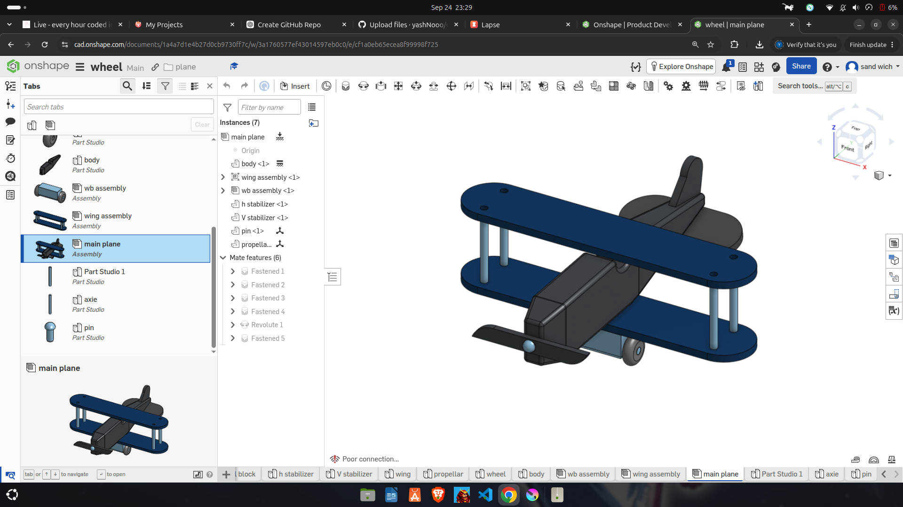

# Onshape Biplane Model

A 3D biplane model designed in Onshape. I created the body, wings, stabilizers, propeller, wheels, and other small parts in separate Part Studios, then brought them together in an Assembly.

## Preview

## Onshape Project

[View and explore the project in Onshape](https://cad.onshape.com/documents/1a4a7d1e4b27d0cb9730ff7c/w/3a1760577ef43014597eb0c0/e/cf1a0eb65ecea8f99998f725?renderMode=0&uiState=6ab56699c3afed83b676b512)

## Files

- `plane-parts.zip` — STEP exports of the individual Part Studios
- `plane-assembly.zip` — complete assembled biplane model

## About the Project

This project helped me practise creating parts separately and assembling them into a complete 3D model in Onshape. The biplane includes two wings, a body, a tail, a propeller, and wheels.
